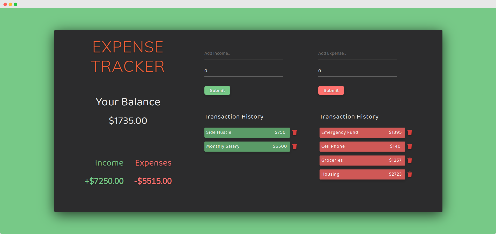

#  Finance Tracker

<h4>💵 An finance tracker that helps you managing your financial, powered by React.js</h4>

It also persists your incomes and expenses as it saves your input to your browser's local storage, so feel free to refresh the tab :)

<br>

## Preview

This is how Finance Tracker looks:



<br>

## How to Run

In the project directory, you can :

1. Install dependencies :

```
yarn
```

2. Run this app in a browser :

```
yarn start
```

Open [http://localhost:3000](http://localhost:3000) to view it in a browser.

<br>


